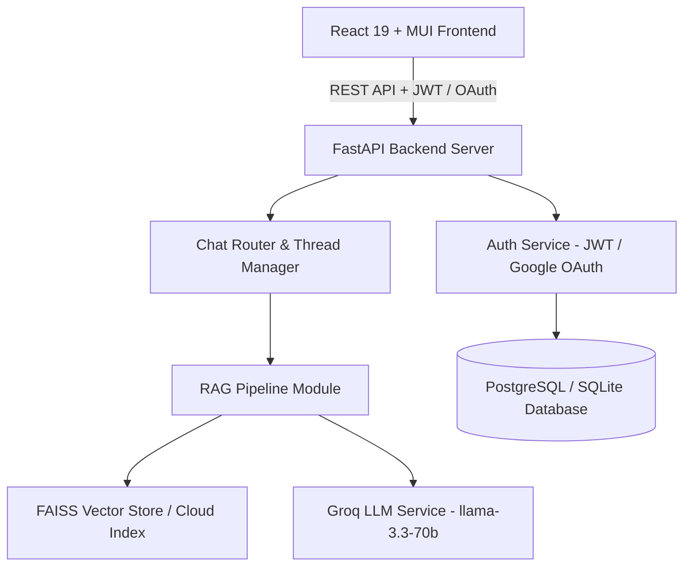

# 🌤️ MTI Meteorological Knowledge Assistant (RAG Pipeline System - Version 2)

An intelligent, grounded Retrieval-Augmented Generation (RAG) assistant built for the **Meteorological Training Institute (MTI)** - **India Meteorological Department (IMD)**.

The system empowers meteorologists, trainees, and operational forecasters to query official meteorological training literature, atmospheric physics reference manuals, and weather forecasting guidelines with strict anti-hallucination guardrails and rich scientific formatting.

---

## 🌟 Key Features

- 🔐 **Enterprise Authentication**: User registration, login, and Google OAuth 2.0 integration with JWT sessions and bcrypt password hashing.
- 📚 **Grounded RAG Pipeline**: Context-aware retrieval over MTI training literature using semantic document search and Groq LLMs (`llama-3.3-70b-versatile`).
- 🛡️ **Anti-Hallucination & Out-of-Domain Guardrails**: Strict prompt constraints that decline non-meteorological trivia and prevent fabricated facts.
- 💬 **Multi-Threaded Conversation History**: Thread creation, thread renaming, message history persistence, and full conversation export to PDF.
- 🎙️ **Voice Control & Text-to-Speech**: Speech-to-text input, voice action commands, and read-aloud TTS capabilities for hands-free operational use.
- 🎨 **Modern Executive UI**: Crafted with React 19, Material-UI, dark/light theme switching, glassmorphism aesthetics, and responsive layout.

---

## 🏗️ System Architecture



---

## 🛠️ Technology Stack

### **Frontend**
- **Framework**: React 19 (Vite build tool)
- **UI System**: Material-UI (MUI v6/v9), Emotion Styled System
- **State & Router**: React Router v7, Axios, Session Storage
- **PDF Export**: jsPDF + HTML Canvas

### **Backend**
- **Framework**: Python 3.10+ / FastAPI
- **Database ORM**: SQLAlchemy (PostgreSQL / SQLite)
- **Authentication**: `python-jose` (JWT), `passlib[bcrypt]`, `google-auth`
- **RAG & LLM Engine**: Groq API (`llama-3.3-70b-versatile`), PyPDF, FAISS / Vector Retriever

---

## 🚀 Quick Start & Local Setup

### **Prerequisites**
- Node.js (v18+) & npm
- Python (3.10+)

---

### **1. Backend Setup**

1. Navigate to the backend directory:
   ```bash
   cd backend
   ```

2. Create and activate a Python virtual environment:
   ```bash
   python -m venv .venv
   # Windows (PowerShell)
   .\.venv\Scripts\Activate.ps1
   # macOS/Linux
   source .venv/bin/activate
   ```

3. Install backend dependencies:
   ```bash
   pip install -r ../requirements.txt
   ```

4. Configure environment variables in `backend/.env`:
   ```env
   JWT_SECRET_KEY=your_secure_random_jwt_secret_here
   ACCESS_TOKEN_EXPIRE_MINUTES=10080
   DATABASE_URL=sqlite:///./mti_assistant.db
   GROQ_API_KEY=your_groq_api_key_here
   GROQ_MODEL=llama-3.3-70b-versatile
   GOOGLE_CLIENT_ID=your_google_oauth_client_id
   RAG_PIPELINE_MODULE=rag.pipeline
   RAG_PIPELINE_FUNCTION=ask_question
   ```

5. Run the FastAPI development server:
   ```bash
   uvicorn main:app --reload --port 8000
   ```
   API Docs will be available at `http://localhost:8000/docs`.

---

### **2. Frontend Setup**

1. Navigate to the frontend directory:
   ```bash
   cd "frontend/MTI_RAG_Project_Version 2"
   ```

2. Install dependencies:
   ```bash
   npm install
   ```

3. Configure environment variables in `frontend/MTI_RAG_Project_Version 2/.env`:
   ```env
   VITE_API_BASE_URL=http://localhost:8000
   VITE_GOOGLE_CLIENT_ID=your_google_oauth_client_id
   ```

4. Start the Vite development server:
   ```bash
   npm run dev
   ```
   The application will be running at `http://localhost:5173`.

---

## 📖 Building the Vector Index (Local Ingestion)

To ingest MTI PDF documents into the local FAISS index:

1. Place PDF documents in the `data/` directory.
2. Run the build index module:
   ```bash
   python -m rag.build_index
   ```
3. The generated index files will be stored in `rag/store/` (`index.faiss` and `index.pkl`).

---

## 📡 API Endpoint Reference

| Endpoint | Method | Description |
| :--- | :--- | :--- |
| `/register` | `POST` | Register a new user with name, email, and password |
| `/login` | `POST` | Authenticate user credentials and return JWT bearer token |
| `/auth/google` | `POST` | Authenticate via Google Sign-In OAuth ID credential |
| `/chat` | `POST` | Process user meteorological question through RAG pipeline |
| `/threads` | `GET` | Retrieve user's conversation threads |
| `/threads/{id}/messages` | `GET` | Load messages for a specific conversation thread |
| `/threads/{id}` | `PUT` / `DELETE` | Rename or delete a conversation thread |
| `/health` | `GET` | Health check endpoint |

---

## ☁️ Deployment Guide

### **Deploying to Vercel**
The project includes a root `vercel.json` configured for Vercel static frontend builds and Python serverless functions.

1. Connect your repository to Vercel.
2. Set Environment Variables in **Vercel Project Settings**:
   - `GROQ_API_KEY`: Your Groq API Key
   - `JWT_SECRET_KEY`: Random secret string
   - `DATABASE_URL`: Hosted Postgres URL (Neon / Supabase) or omit for `/tmp` fallback
3. Deploy!

### **Deploying to IMD Physical Server (Docker & LAMP Reverse Proxy)**
For on-premise physical servers running Apache / LAMP:
1. Ensure Docker & Docker Compose are installed.
2. Run `docker compose up --build -d`.
3. Configure Apache reverse proxy to point to port `3000` (see [DEPLOYMENT.md](file:///c:/Manas/Studies/MTI%20Internship/Version%202/MTI-RAG-Project-Ver-2/DEPLOYMENT.md) and [deploy/apache-imd-reverse-proxy.conf](file:///c:/Manas/Studies/MTI%20Internship/Version%202/MTI-RAG-Project-Ver-2/deploy/apache-imd-reverse-proxy.conf)).

### **Deploying Backend to Render / Railway**
For high-traffic or persistent disk environments (PostgreSQL + FAISS):
1. Create a Python Web Service on Render or Railway pointing to `backend/main.py`.
2. Start command: `uvicorn backend.main:app --host 0.0.0.0 --port $PORT`
3. Set `VITE_API_BASE_URL` in Vercel to your deployed backend service URL.

---

## 🛡️ Security & Privacy Notice

- Database `.db` files (`mti_assistant.db`, `mti_rag.db`) and `.env` credentials are **excluded from Git tracking** (`.gitignore`).
- Passwords are securely hashed using `bcrypt` before database storage.
- Out-of-domain requests are filtered out before external LLM invocation.

---

## 📄 License & Attribution

Developed for the **Meteorological Training Institute (MTI)** & **India Meteorological Department (IMD)**.
All training literature and weather reference materials are property of IMD.
